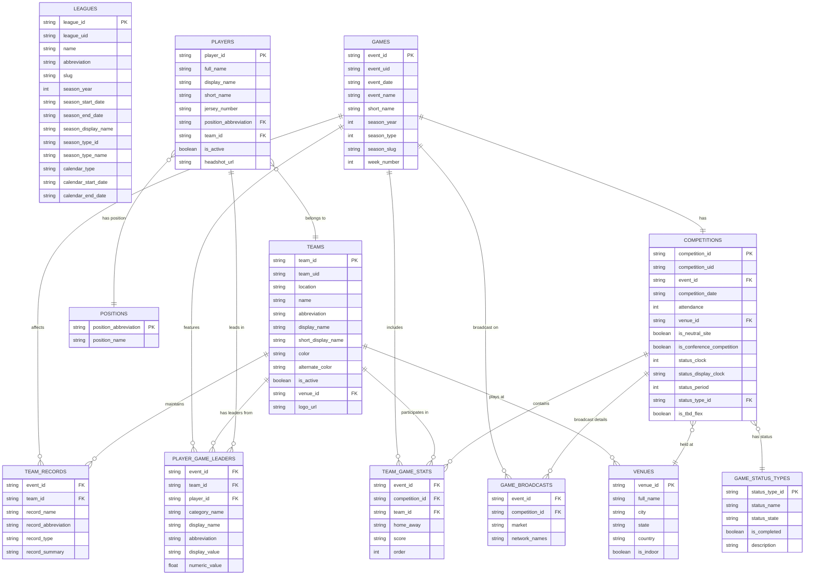

# ESPN NFL Data Model - Entity Relationship Diagram

This diagram shows the relationships between all tables in the normalized ESPN NFL dataset.

## Key Relationships

### Core Game Structure

- **GAMES** (1) ←→ (1) **COMPETITIONS**: Each game has one competition
- **COMPETITIONS** (N) → (1) **VENUES**: Multiple games can be at same venue
- **COMPETITIONS** (N) → (1) **GAME_STATUS_TYPES**: Games have status types

### Team Structure

- **TEAMS** (N) → (1) **VENUES**: Teams have home venues
- **PLAYERS** (N) → (1) **TEAMS**: Players belong to teams
- **PLAYERS** (N) → (1) **POSITIONS**: Players have positions

### Game Statistics

- **GAMES** (1) → (N) **TEAM_GAME_STATS**: Each game has 2 team stats records
- **TEAMS** (1) → (N) **TEAM_GAME_STATS**: Teams play multiple games
- **GAMES** (1) → (N) **PLAYER_GAME_LEADERS**: Games have multiple stat leaders
- **PLAYERS** (1) → (N) **PLAYER_GAME_LEADERS**: Players can lead in multiple categories

### Supporting Data

- **GAMES** (1) → (N) **GAME_BROADCASTS**: Games have broadcast info
- **GAMES** (1) → (N) **TEAM_RECORDS**: Games affect team records

## Table Types

### Dimension Tables (Lookup)

- LEAGUES, TEAMS, VENUES, PLAYERS, POSITIONS, GAME_STATUS_TYPES

### Fact Tables (Transactions)

- GAMES, COMPETITIONS, TEAM_GAME_STATS, PLAYER_GAME_LEADERS, GAME_BROADCASTS, TEAM_RECORDS
